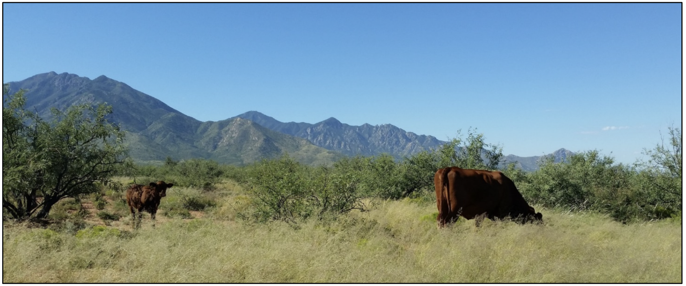
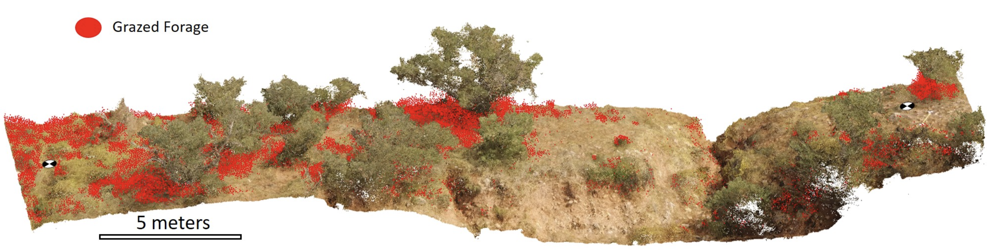
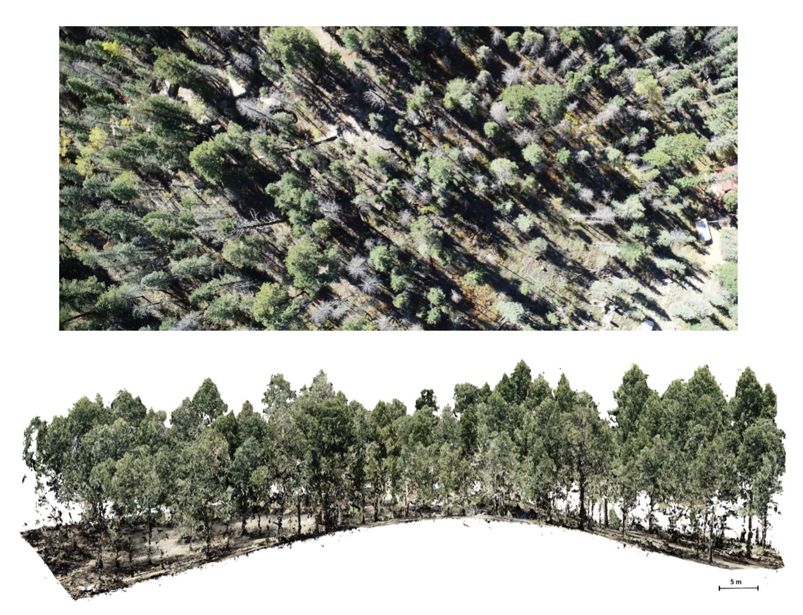
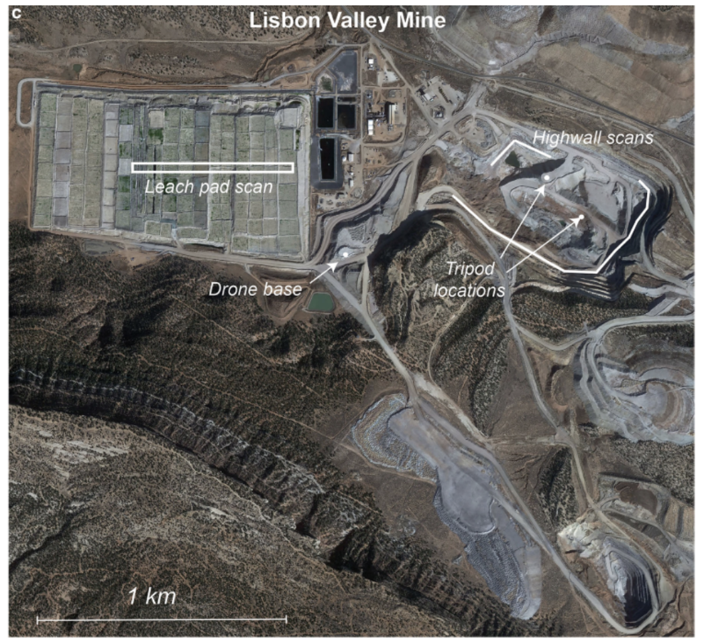
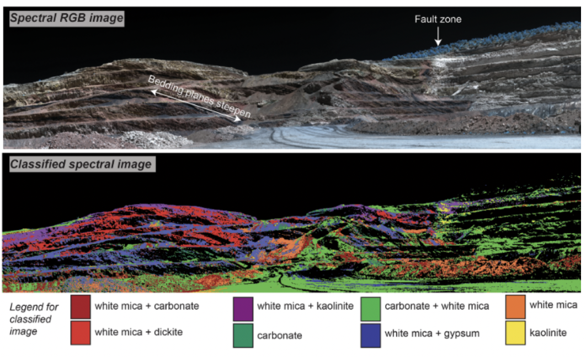
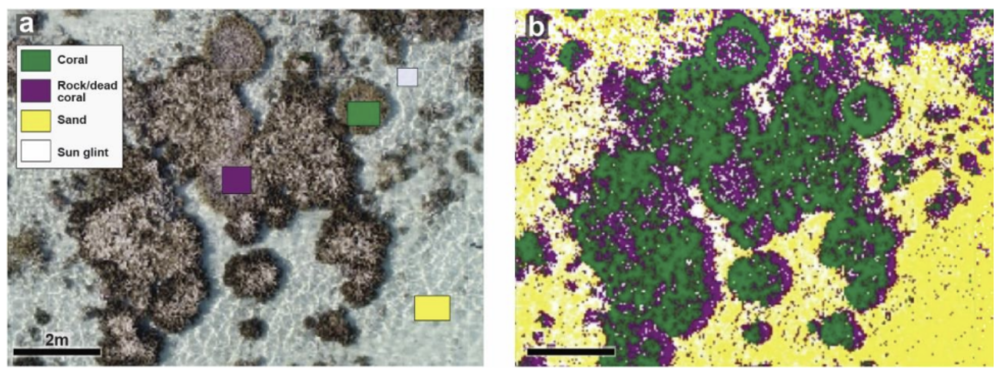
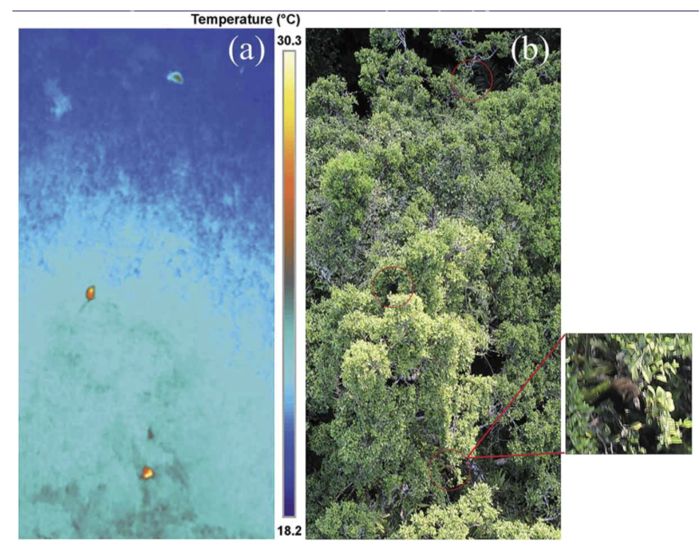
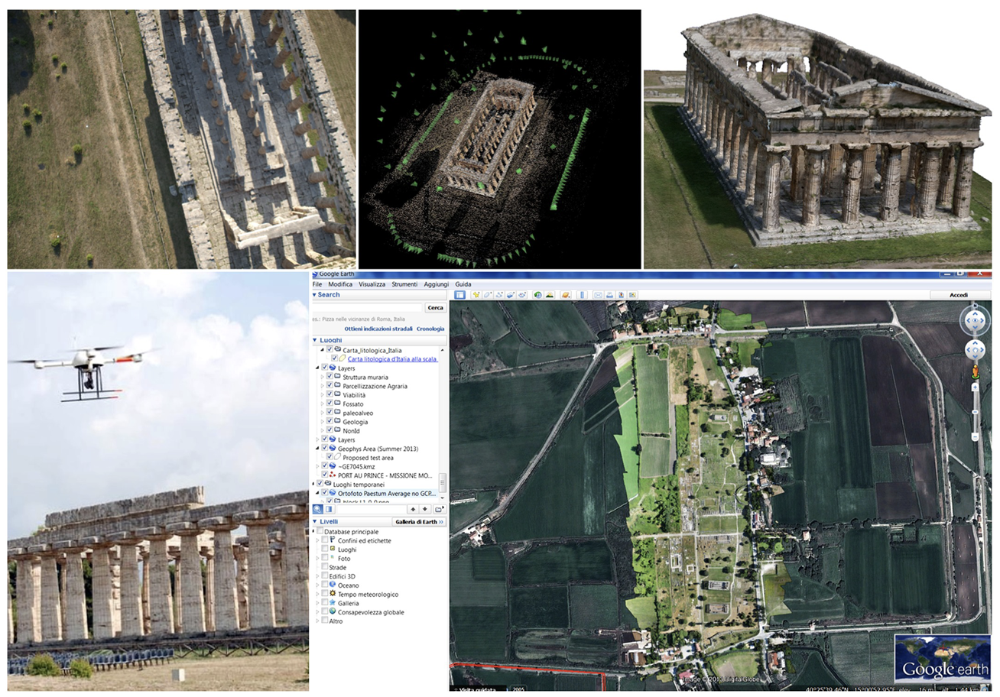
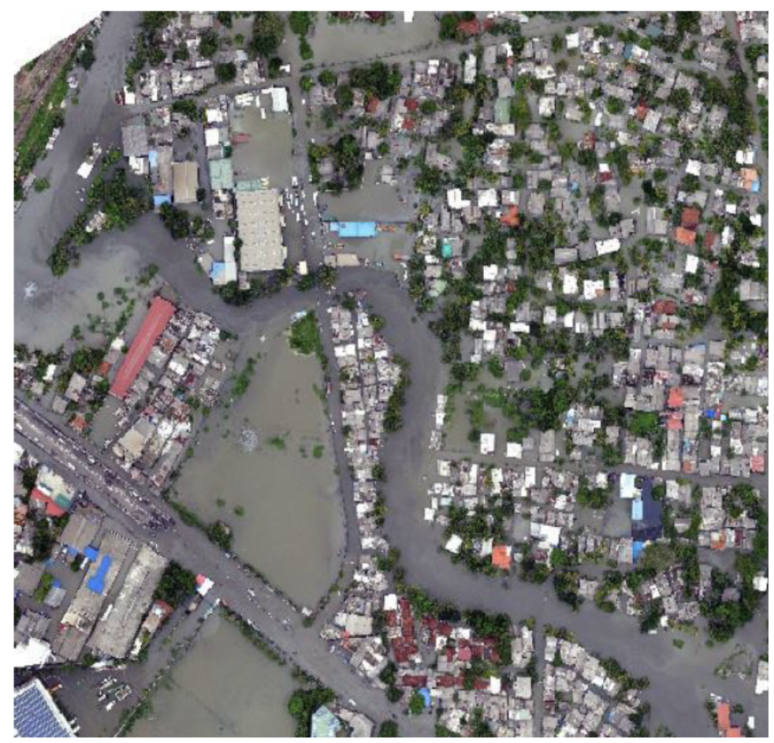

## Plant Agriculture
___
## Rangeland Management
Drone imagery mapping can provide many types of data useful for rangeland management and monitoring:

* Vegetation cover and composition 
* Estimating forage utilization 
* Calculating percentage of bare ground and size of canpy gaps 
* Estimating forage and woody biomass 

<figure markdown>
  { width="500" }
  <figcaption>Cattle grazing at the Santa Rita Range in southern Arizona</figcaption>
</figure>

<figure markdown>
  { width="600" }
  <figcaption>Photogrammetric point cloud depicting forage utilization</figcaption>
</figure>

??? Tip "Examples From the Literature"

    [Integrating drone imagery with existing rangeland monitoring programs](https://link.springer.com/article/10.1007/s10661-020-8216-3){target=_blank}
      
    [Innovations to expand drone data collection and analysis for rangelands](https://esajournals.onlinelibrary.wiley.com/doi/full/10.1002/ecs2.3649){target=_blank}
      
    [A pilot study to estimate forage mass from unmanned aerial vehicles in a semi-arid rangeland](https://www.mdpi.com/2072-4292/12/15/2431){target=_blank}

<iframe width="700" height="300" src="https://www.youtube.com/embed/UDt6p9xyosI" title="Monitoring Rangelands with Drones for Sustainable Land Management" frameborder="0" allow="accelerometer; autoplay; clipboard-write; encrypted-media; gyroscope; picture-in-picture; web-share" allowfullscreen></iframe>
___
## Construction

___
## Civil Engineering
## Forestry
{:height=600 width=600}

## Mining
{:height=300 width=300}
{:height=200 width=300}

## Geology/Volcanology
## Marine Environments
{:height=200 width=300}

## Rivers & Wetlands
## Topographic Change
## Wildlife Surveys
{:height=200 width=300}

## Archaelogy
{:height=200 width=300}

## Disaster Management
{:height=300 width=300}

<iframe width="560" height="315" src="https://www.youtube.com/embed/1VUXgwoNQRs" title="YouTube video player" frameborder="0" allow="accelerometer; autoplay; clipboard-write; encrypted-media; gyroscope; picture-in-picture; web-share" allowfullscreen></iframe>
