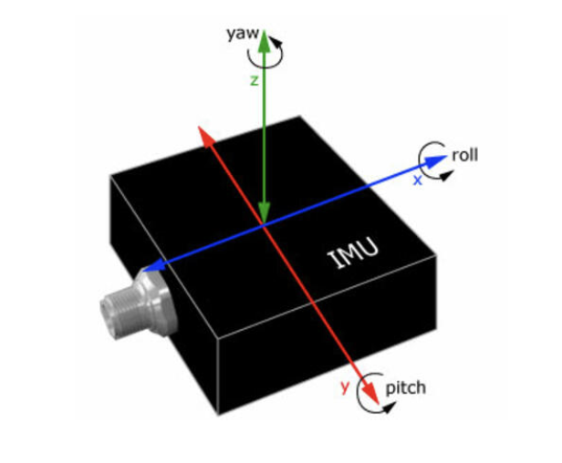

## Terminology

## Drone Types
{:height=200 width=300}

{:height=200 width=300}

{:height="200" width="300"}

<iframe width="560" height="315" src="https://www.youtube.com/embed/BlsHC1kSrE4" title="YouTube video player" frameborder="0" allow="accelerometer; autoplay; clipboard-write; encrypted-media; gyroscope; picture-in-picture; web-share" allowfullscreen></iframe>

## Drone Models

 
 

            
<iframe width="560" height="315" src="https://www.youtube.com/embed/Blr3suSQt-Q" title="YouTube video player" frameborder="0" allow="accelerometer; autoplay; clipboard-write; encrypted-media; gyroscope; picture-in-picture; web-share" allowfullscreen></iframe>     

## Unmanned Aircraft System

## Drone Sensors

### Mounting

## Other Onboard Tech

## Advantages of Drones

## Limitations of Drones

## Mapping Applications
### Plant Agriculture
### Rangeland Management
### Construction
### Civil Engineering
### Forestry
### Mining
### Geology/Volcanology
### Marine Environments
### Rivers & Wetlands
### Topographic Change
### Wildlife Surveys
### Archaelogy
### Disaster Management

<iframe width="560" height="315" src="https://www.youtube.com/embed/1VUXgwoNQRs" title="YouTube video player" frameborder="0" allow="accelerometer; autoplay; clipboard-write; encrypted-media; gyroscope; picture-in-picture; web-share" allowfullscreen></iframe>
