<figure markdown>
  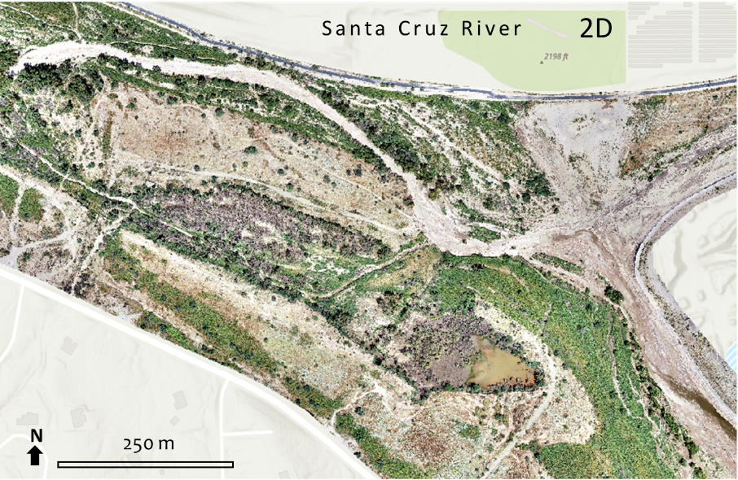{ width="550" }
  <figcaption></figcaption>
</figure>

<figure markdown>
  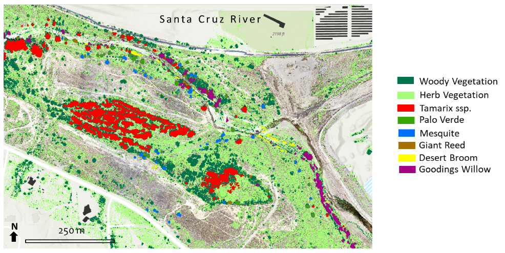{ width="750" }
  <figcaption></figcaption>
</figure>

<figure markdown>
  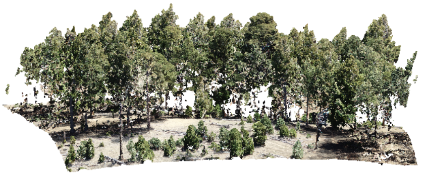{ width="600" }
  <figcaption>Photogrammetric Point Cloud</figcaption>
</figure>

<figure markdown>
  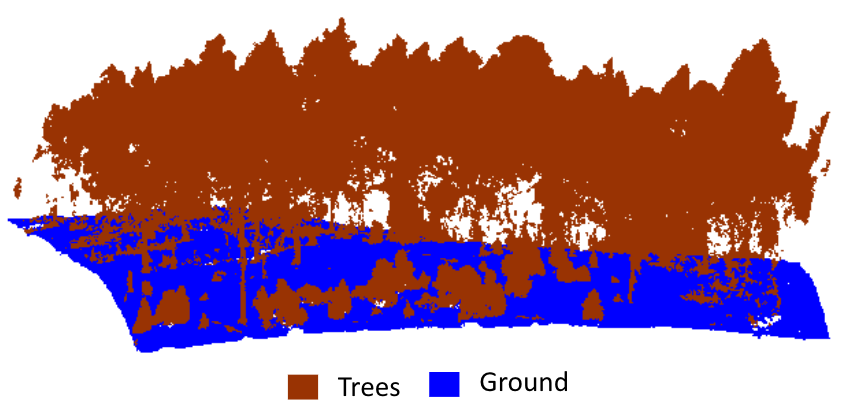{ width="600" }
  <figcaption></figcaption>
</figure>

<figure markdown>
  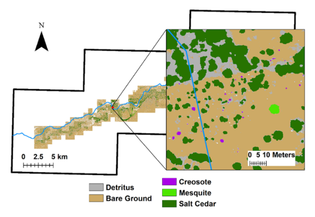{ width="700" }
  <figcaption></figcaption>
</figure>
[Remotely Sensed Changes in Vegetation Cover Distribution and Groundwater along the Lower Gila River](https://doi.org/10.3390/land9090326){target=_blank}

[UAV in the advent of the twenties: Where we stand and what is next](https://doi.org/10.1016/j.isprsjprs.2021.12.006){target=_blank}
<figure markdown>
  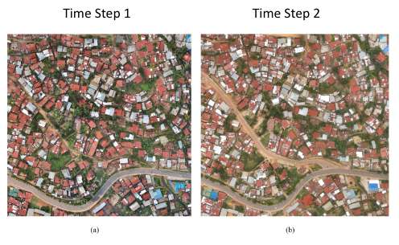{ width="600" }
  <figcaption></figcaption>
</figure>
<figure markdown>
  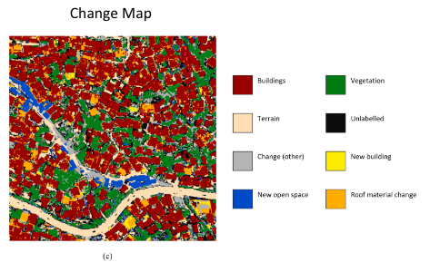{ width="600" }
  <figcaption></figcaption>
</figure>

<figure markdown>
  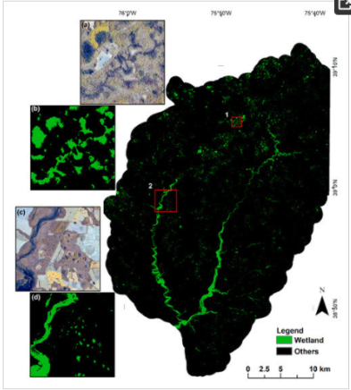{ width="500" }
  <figcaption></figcaption>
</figure>
[Mapping Forested Wetland Inundation in the Delmarva Peninsula, USA Using Deep Convolutional Neural Networks](https://doi.org/10.3390/rs12040644 ){target=_blank}

<figure markdown>
  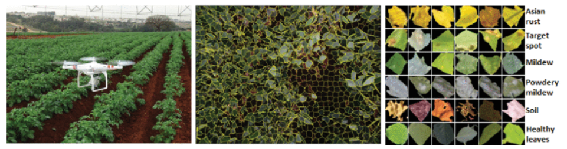{ width="700" }
  <figcaption></figcaption>
</figure>
[Automatic recognition of soybean leaf diseases using UAV images and deep convolutional neural networks](https://doi.org/10.1109/LGRS.2019.2932385 ){target=_blank}

  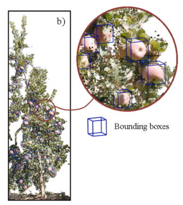{ width="300" } 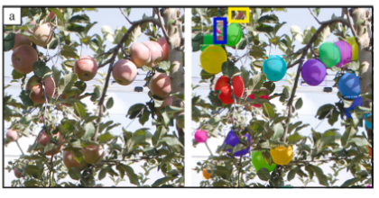{ width="300" }

[Fruit detection and 3D location using instance segmentation neural networks and structure-from-motion photogrammetry](https://doi.org/10.1016/j.compag.2019.105165 ){target=_blank}

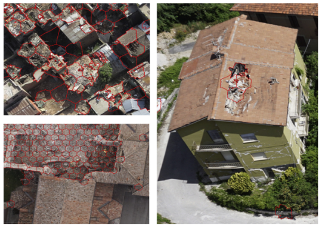{ width="500" }

[Disaster damage detection through synergistic use of deep learning and 3D point cloud features derived from very high resolution oblique aerial images, and multiple-kernel-learning](https://doi.org/10.1016/j.isprsjprs.2017.03.001 ){target=_blank}

<figure markdown>
  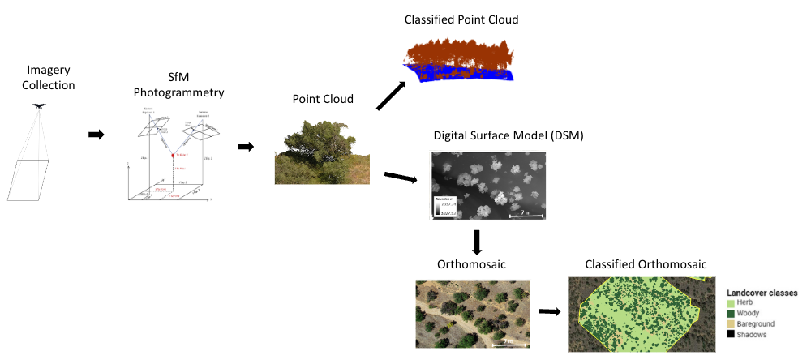{ width="750" }
  <figcaption></figcaption>
</figure>

<iframe width="560" height="315" src="https://www.youtube.com/embed/nULEg3nwhxw" title="YouTube video player" frameborder="0" allow="accelerometer; autoplay; clipboard-write; encrypted-media; gyroscope; picture-in-picture; web-share" allowfullscreen></iframe>
