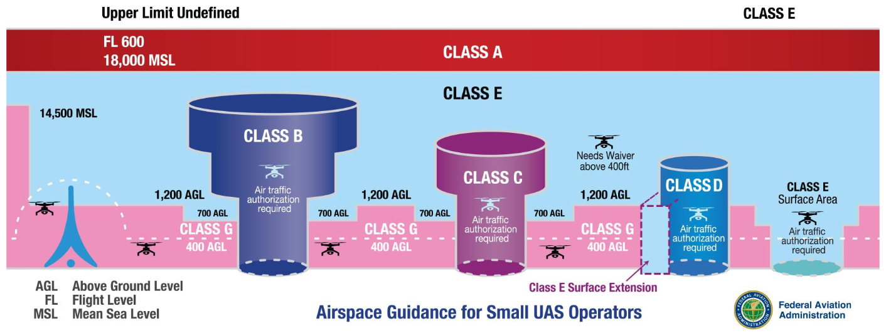
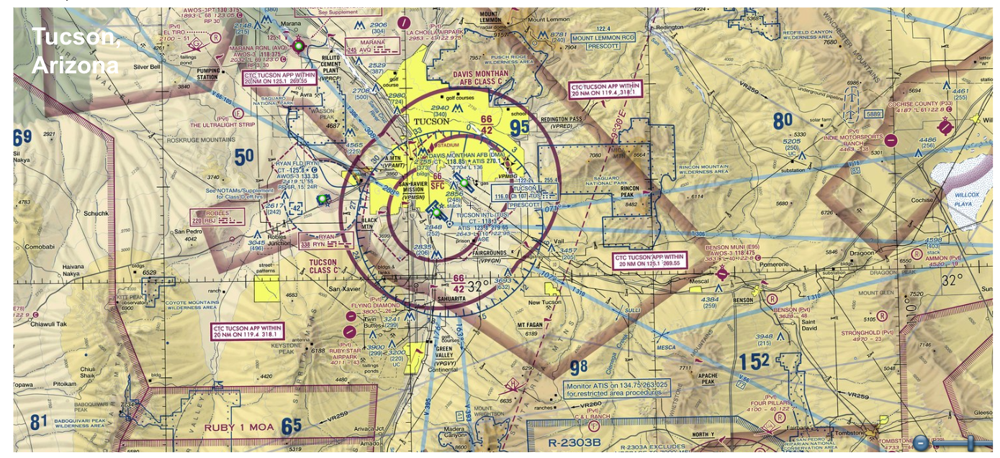
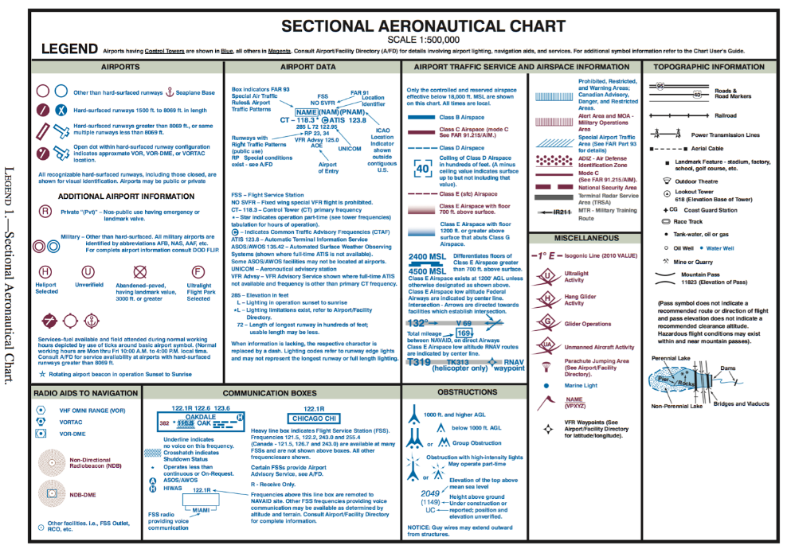
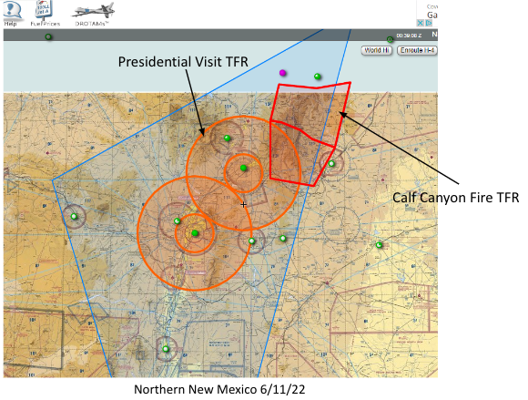
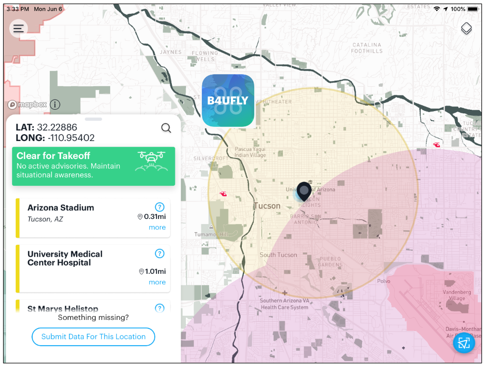
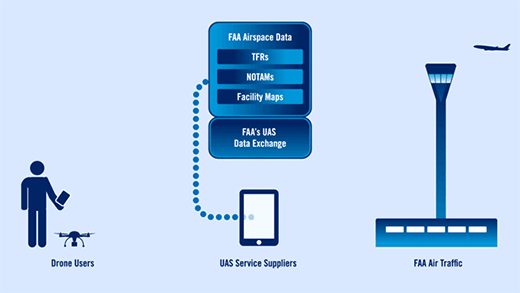
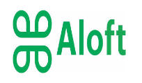

## Drone Registration

## sUAS Part 107 Remote Pilot Certificate

## Part 107 Regulations
#### Aircraft Size

#### Visual Line of Sight

#### Operations Over People

#### Night Operations

#### Operating Limitations

<figure markdown>
  { width="500" }
  <figcaption></figcaption>
</figure>

<figure markdown>
  { width="800" }
  <figcaption></figcaption>
</figure>

<figure markdown>
  { width="300" }
  <figcaption></figcaption>
</figure>

<figure markdown>
  { width="300" }
  <figcaption></figcaption>
</figure>

<figure markdown>
  { width="800" }
  <figcaption></figcaption>
</figure>

<figure markdown>
  { width="800" }
  <figcaption></figcaption>
</figure>

<figure markdown>
  { width="800" }
  <figcaption></figcaption>
</figure>

<figure markdown>
  { width="600" }
  <figcaption></figcaption>
</figure>

<figure markdown>
  { width="180" }
  <figcaption></figcaption>
</figure>

## Remote ID
## Special Waivers
## Airspace Designations
## Sectional Charts
## NOTAMs and TFRs
## Controlled Airspace Permissions
## B4UFly App
## Statute v. Nautical Miles

<iframe width="560" height="315" src="https://www.youtube.com/embed/4FF5AlGCFz4" title="YouTube video player" frameborder="0" allow="accelerometer; autoplay; clipboard-write; encrypted-media; gyroscope; picture-in-picture; web-share" allowfullscreen></iframe>
