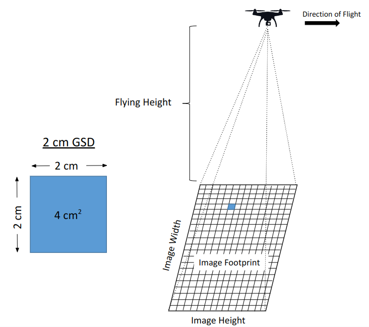
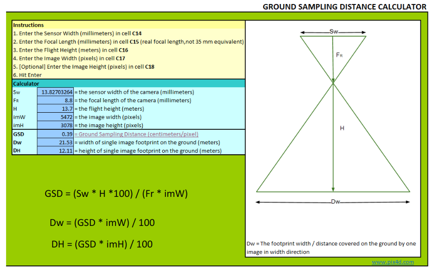

<figure markdown>
  { width="600" }
  <figcaption> </figcaption>
</figure>

  

## Camera Characteristics

Inside the camera, the **Focal Length** is the distance from the lens to the sensor plane (usually reported in mm)
 

<figure markdown>
  { width="750" }
  <figcaption> </figcaption>
</figure>

 

The **camera field of view (FOV)** is the extent of the observable world that can be seen at any give moment. FOV is typically reported in degrees and can vary greatly between lens and camera types. 
 
 
Typically a camera with a longer focal length will have a narrower FOV and a camera with a shorter focal length will have a wider FOV. Drone cameras often have a fairly wide FOV because they are meant
to capture landscapes. 
 
 
The graphic below shows the relationship between focal length and FOV. Highlighted is the DJI Phantom 4 multi-rotor drone. 

<figure markdown>
  { width="600" }
  <figcaption> </figcaption>
</figure>

 
Digital cameras have an array of tiny photosites (corresponding to pixels) that make up the light sensitive sensor. The physical size (width and height in mm) as well as
the number of photosites can vary between sensors. 
 
 
The graphic below shows the sensor array of the Phantom 4 camera. Multiplying the number of photosides (pixels) wide by the number of photosites
heigh will tell you the total number of photosites for the array. In our example, the camera has 19.9 million pixels, which are also called megapixels. 

<figure markdown>
  { width="600" }
  <figcaption> </figcaption>
</figure>
 
____
## Image Footprint and Ground Sampling
**Image Footprint** is the rectangular ground area that is captured by a camera exposure. 

**Ground Sampling Distance (GSD)** is the width of area on the ground that is captured by on pixel. It is also commonly referred to as pixel _size_.
 
For example, a pixel that captures an area of 2 x 2 cm (4 cm^2^) is said to have a GSD of 2 cm. 
  

<figure markdown>
  { width="700" }
  <figcaption> </figcaption>
</figure>

 
As a drone camera gets higher in the sky (further away from the ground), the image footprint and GSD get larger.
  
<figure markdown>
  { width="800" }
  <figcaption> </figcaption>
</figure>

We can calculate the image footprint and GSD with simple formulas that include the camera physical characteristics and flying height. 

??? Tip "Image Footprint and GSD Calculator"

    [Pix4D](https://www.pix4d.com/){target=_blank} has a nice [GSD calculator tool]([https://support.pix4d.com/hc/en-us/articles/202560249-TOOLS-GSD-calculator]      (https://s3.amazonaws.com/mics.pix4d.com/KB/documents/Pix4D_GSD_Calculator.xlsx)){target=_blank} to calculate image dimensions and pixel ground sampling distance based on your drone specs
    <figure markdown>
     { width="700" }
      <figcaption> </figcaption>
    </figure>

<figure markdown>
  { width="450" }
  <figcaption> </figcaption>
</figure>

<iframe width="560" height="315" src="https://www.youtube.com/embed/bTIgjjeYtWY" title="YouTube video player" frameborder="0" allow="accelerometer; autoplay; clipboard-write; encrypted-media; gyroscope; picture-in-picture; web-share" allowfullscreen></iframe>
