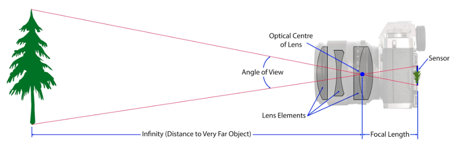
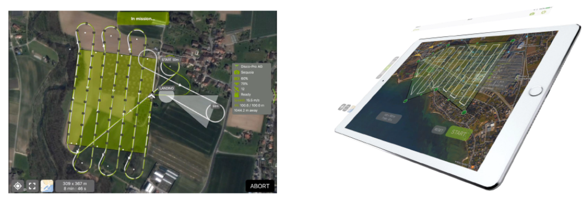
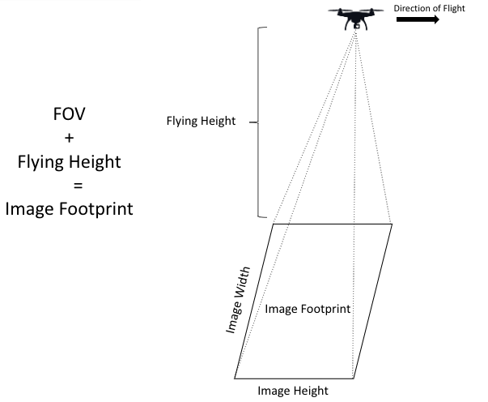
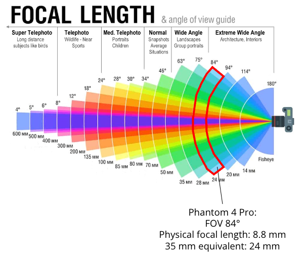
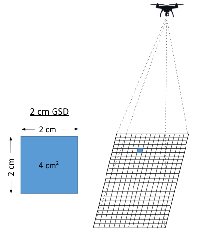
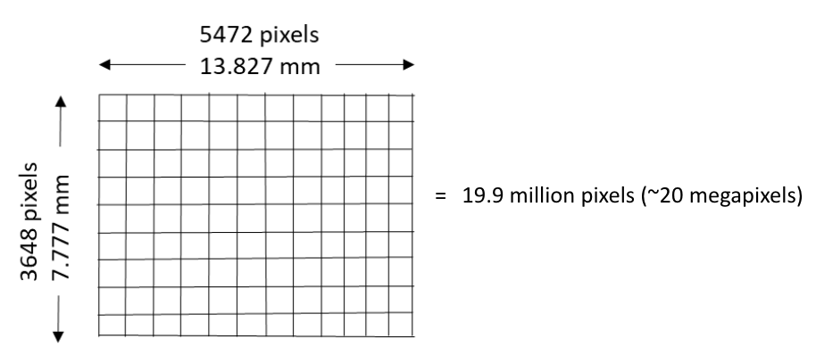

## Camera Characteristics
<figure markdown>
  { width="450" }
  <figcaption> </figcaption>
</figure>

 

<figure markdown>
  { width="450" }
  <figcaption> </figcaption>
</figure>

 

<figure markdown>
  { width="450" }
  <figcaption> </figcaption>
</figure>

<figure markdown>
  { width="450" }
  <figcaption> </figcaption>
</figure>

<figure markdown>
  { width="450" }
  <figcaption> </figcaption>
</figure>

<figure markdown>
  { width="450" }
  <figcaption> </figcaption>
</figure>

<figure markdown>
  { width="450" }
  <figcaption> </figcaption>
</figure>

<iframe width="560" height="315" src="https://www.youtube.com/embed/bTIgjjeYtWY" title="YouTube video player" frameborder="0" allow="accelerometer; autoplay; clipboard-write; encrypted-media; gyroscope; picture-in-picture; web-share" allowfullscreen></iframe>
