##Point Clouds

<iframe width="560" height="315" src="https://www.youtube.com/embed/yXCkyuo8bcs" title="YouTube video player" frameborder="0" allow="accelerometer; autoplay; clipboard-write; encrypted-media; gyroscope; picture-in-picture; web-share" allowfullscreen></iframe>

<figure markdown>
  { width="700" }
  <figcaption></figcaption>
</figure>

<figure markdown>
  { width="700" }
  <figcaption></figcaption>
</figure>

<figure markdown>
  { width="700" }
  <figcaption></figcaption>
</figure>

<figure markdown>
  { width="700" }
  <figcaption></figcaption>
</figure>

<figure markdown>
  { width="700" }
  <figcaption></figcaption>
</figure>

<figure markdown>
  { width="700" }
  <figcaption></figcaption>
</figure>

<figure markdown>
  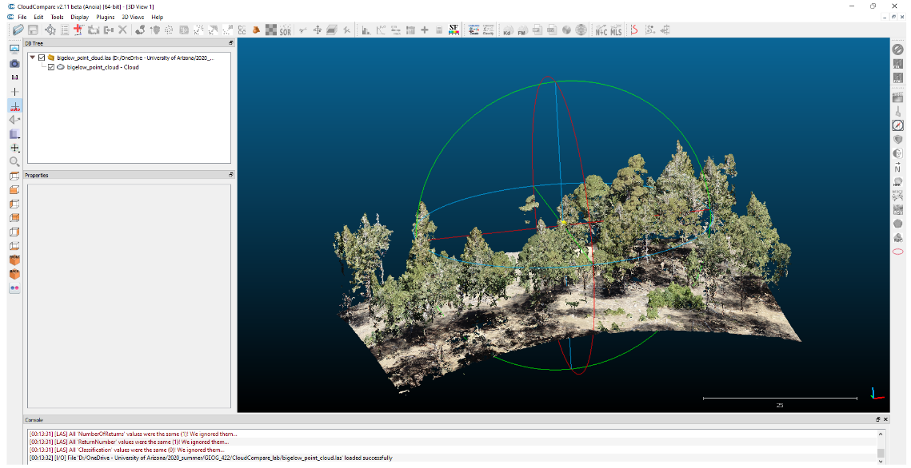{ width="700" }
  <figcaption></figcaption>
</figure>

##Digital Elevation Models

###Digital Surface Models (DSMs)

<figure markdown>
  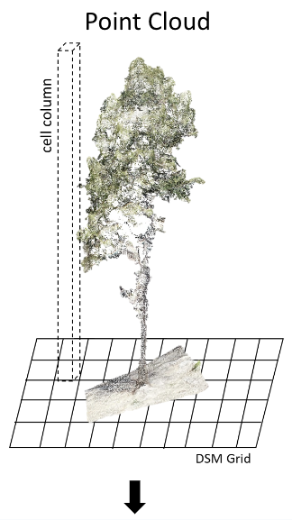{ width="300" }
  <figcaption></figcaption>
</figure>
<figure markdown>
  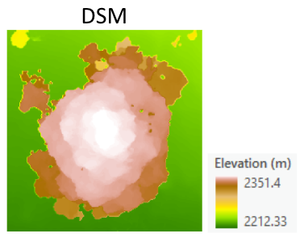{ width="300" }
  <figcaption></figcaption>
</figure>

<figure markdown>
  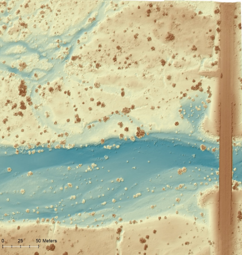{ width="500" }
  <figcaption></figcaption>
</figure>

<figure markdown>
  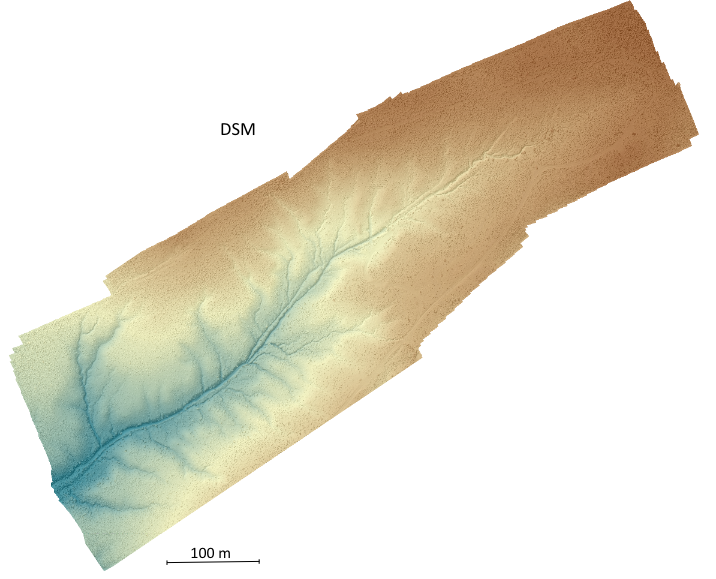{ width="700" }
  <figcaption></figcaption>
</figure>

###Digital Terrain Models (DTMs)

<figure markdown>
  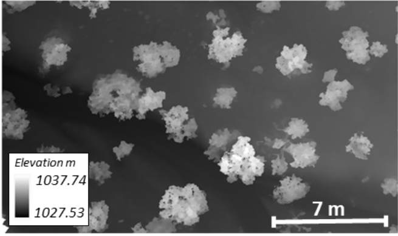{ width="500" }
  <figcaption></figcaption>
</figure>

<figure markdown>
  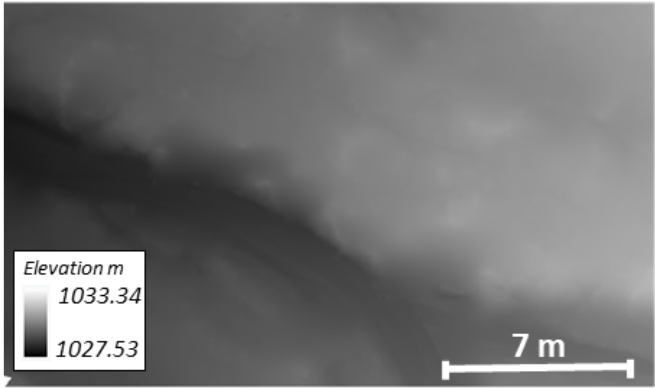{ width="500" }
  <figcaption></figcaption>
</figure>

<figure markdown>
  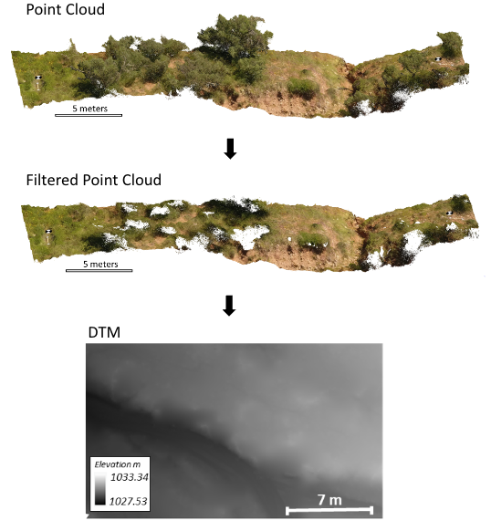{ width="500" }
  <figcaption></figcaption>
</figure>

<figure markdown>
  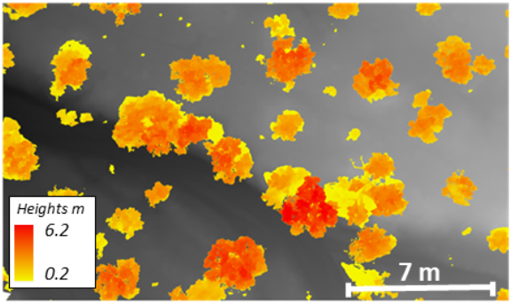{ width="500" }
  <figcaption></figcaption>
</figure>

##Orthomosaic
<iframe width="560" height="315" src="https://www.youtube.com/embed/g8mapLUXyGI" title="YouTube video player" frameborder="0" allow="accelerometer; autoplay; clipboard-write; encrypted-media; gyroscope; picture-in-picture; web-share" allowfullscreen></iframe>

<figure markdown>
  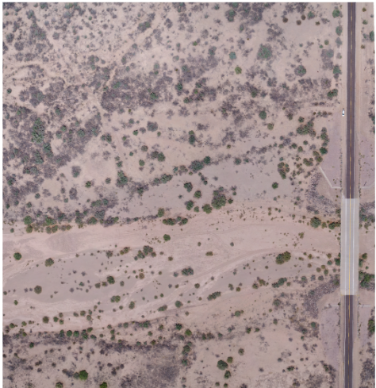{ width="400" }
  <figcaption></figcaption>
</figure>

<figure markdown>
  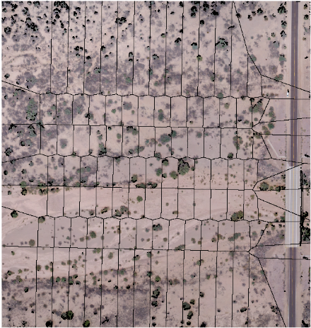{ width="400" }
  <figcaption></figcaption>
</figure>

<figure markdown>
  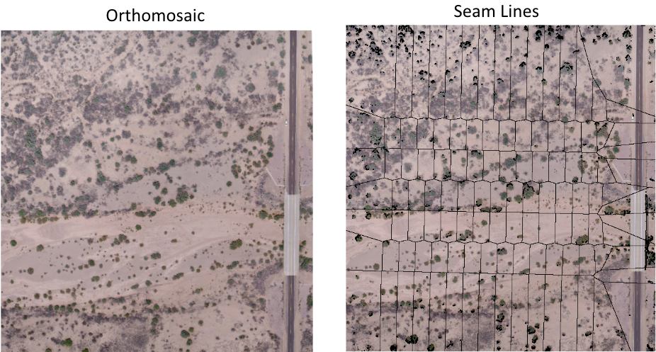{ width="700" }
  <figcaption></figcaption>
</figure>

<figure markdown>
  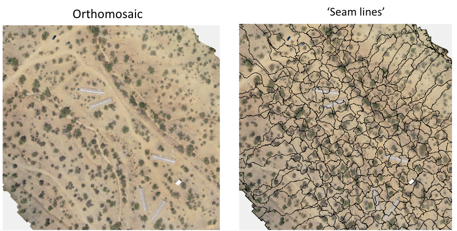{ width="700" }
  <figcaption></figcaption>
</figure>

<figure markdown>
  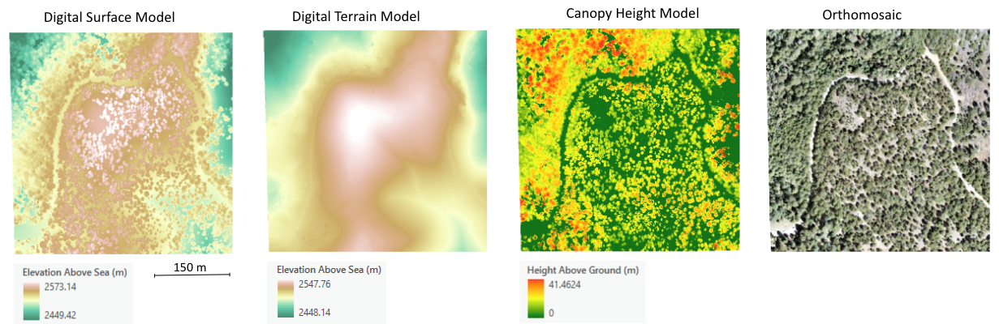{ width="800" }
  <figcaption></figcaption>
</figure>

<figure markdown>
  { width="600" }
  <figcaption></figcaption>
</figure>

<figure markdown>
  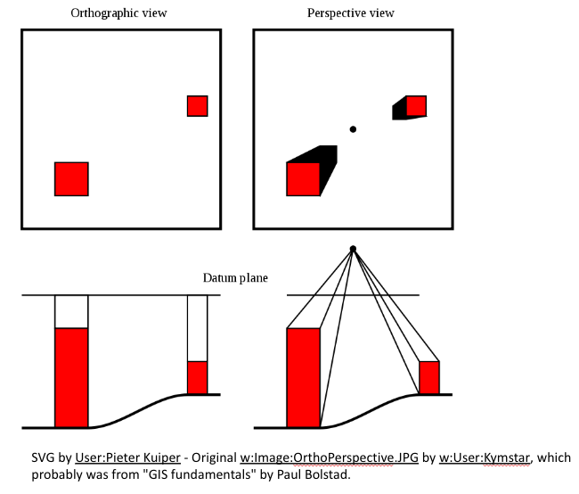{ width="600" }
  <figcaption></figcaption>
</figure>

<iframe width="560" height="315" src="https://www.youtube.com/embed/Dwk_Jm0efVc" title="YouTube video player" frameborder="0" allow="accelerometer; autoplay; clipboard-write; encrypted-media; gyroscope; picture-in-picture; web-share" allowfullscreen></iframe>
