{target=_blank} 

# :material-cloud-braces: Resource Mapping with Drones

#### Instructors(s): 

[Jeffrey Gillan, PhD](https://www.gillanscience.com){target=_blank} 
## About
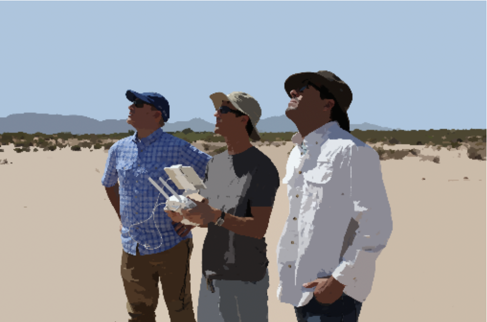{:height=300 width=300}
 
Welcome! This is an introductory course on how to use small drones for aerial mapping of land and resources. 
 

            * You will learn all the skills necessary to create precisely surveyed maps using photogrammetry methods. 

            * We will cover all of the industries and applications where drone imagery maps are making big impacts on society. 

            * Additionally, students will learn how to become licensed drones pilots with the Federal Aviation Administration (FAA). 

## Terminology
Let's start with terminology. There are a lot of different ways to refer to a remote control aircraft. I use the term **drone** most often because this has become the defacto term in society. Most people understand what you mean when you say **drone**. 
 

There are a number of different acronyms used to refer to drones. Some differ depending on the industry, application, or context. But for the most part, the following acronyms are generally interchangeable. 

**Unmmaned Aircraft (UA)**
 
This is an aircraft where the pilot is not onboard. It is piloted remotely, probably through radio signals. 
 
 
**Unmanned Aerial Vehicle (UAV)**
 
This is the same thing as a **UA**
 
 
**Unmanned Aerial System (UAS)**
 
This term refers to the entire flying system, not just the aircraft itself. Other components of the system include the remote control, the pilot, GPS, IMU, cameras, etc.
 
 
**Uncrewed Aerial System (UAS)**
 
This is the gender neurtral term for **UAS** 
 
 
**Small Unmanned Aerial System (sUAS)**
 
This term refers to a specific weight class of UAV aircraft as designated by the FAA. To meet the definition of sUAS, aircraft need to weight less than 55 lbs on takeoff. 
 
 
**Remotely Piloted Aircraft (RPA)**
 
This is just another term for a drone that does not seem to get much use nowadays. 
 

## Drone Types
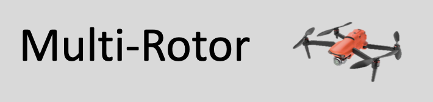{:height=200 width=300}
 
Multi-rotor drones are great aircraft. Here are some characteristics: 
 

+ Usually Less Expensive to Buy

+ Vertical Launch and Landing

- Shorter Flight Endurance

- Able to Map Smaller Areas

* Very Precise Flying

* Precise Control of Gimbal Angle 

 
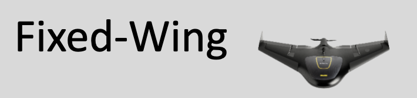{:height=200 width=300}
 

* Relatively Expensive

* Throw Launch

* Belly Crash Landing

* Longer Flight Endurance

* Able to map very large areas

* Less Precise Flying

* Less Control of Camera Angle (via gimbal)

 
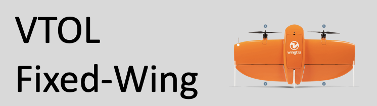{:height="200" width="300"}
 

* All the advantages of the fixed-wing with the ability of vertical take-off and landing. 

<iframe width="560" height="315" src="https://www.youtube.com/embed/82gn8EFOQd0" title="YouTube video player" frameborder="0" allow="accelerometer; autoplay; clipboard-write; encrypted-media; gyroscope; picture-in-picture; web-share" allowfullscreen></iframe>
 
<iframe width="560" height="315" src="https://www.youtube.com/embed/4qCRVOGjFgI" title="YouTube video player" frameborder="0" allow="accelerometer; autoplay; clipboard-write; encrypted-media; gyroscope; picture-in-picture; web-share" allowfullscreen></iframe>
 
<iframe width="560" height="315" src="https://www.youtube.com/embed/BlsHC1kSrE4" title="YouTube video player" frameborder="0" allow="accelerometer; autoplay; clipboard-write; encrypted-media; gyroscope; picture-in-picture; web-share" allowfullscreen></iframe>

## Drone Models
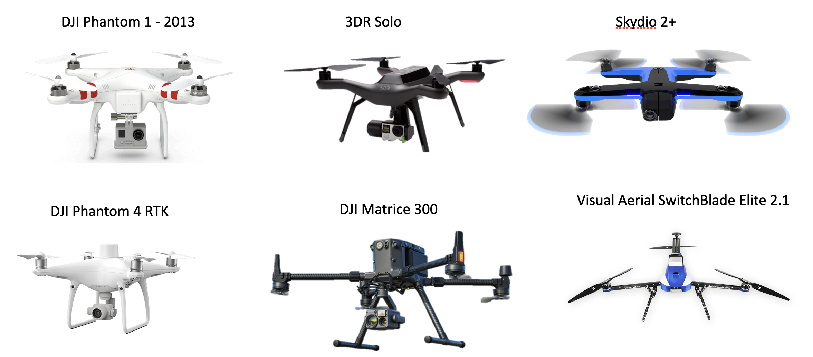
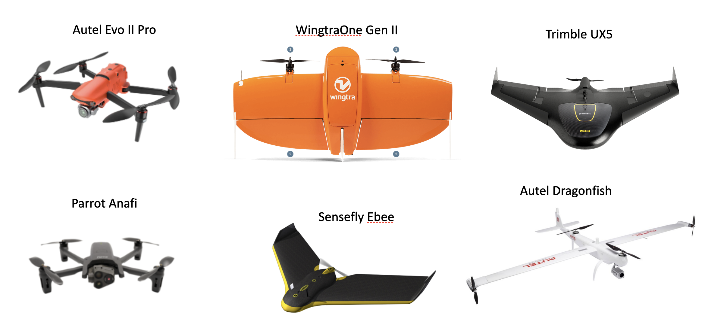

 
 

            
<iframe width="560" height="315" src="https://www.youtube.com/embed/Blr3suSQt-Q" title="YouTube video player" frameborder="0" allow="accelerometer; autoplay; clipboard-write; encrypted-media; gyroscope; picture-in-picture; web-share" allowfullscreen></iframe>     

## Unmanned Aircraft System

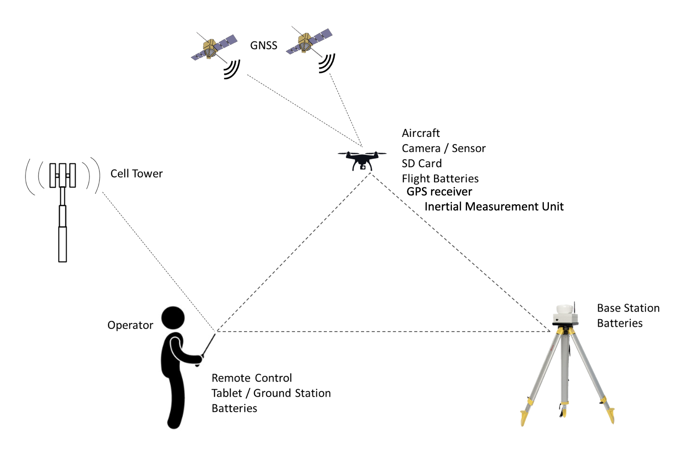

## Drone Sensors
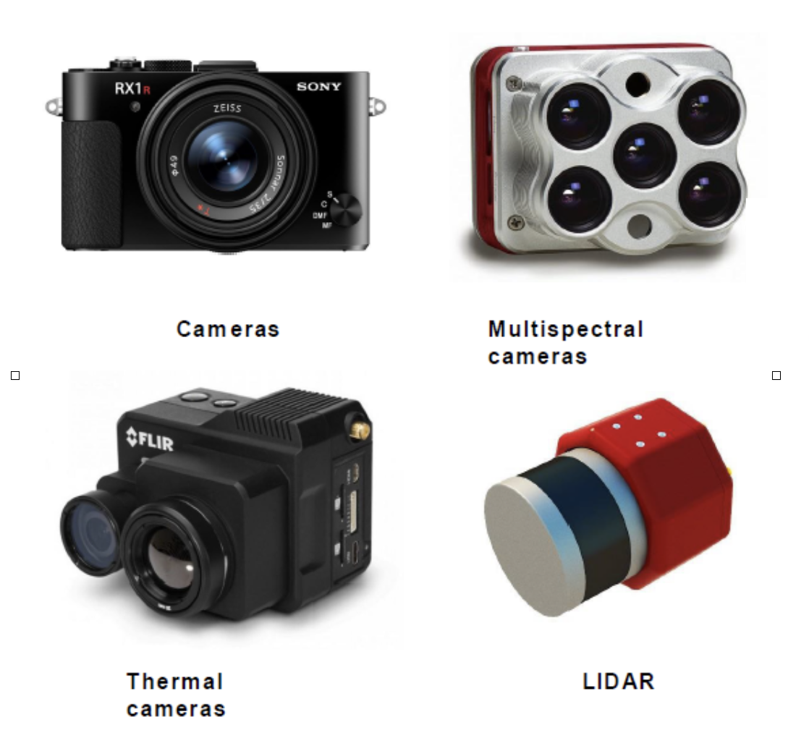
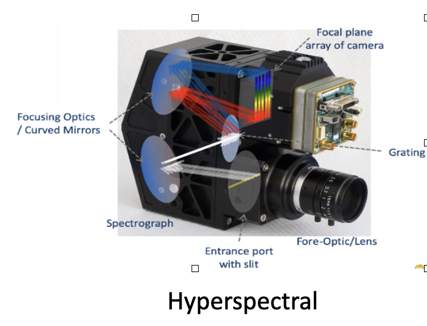

### Mounting
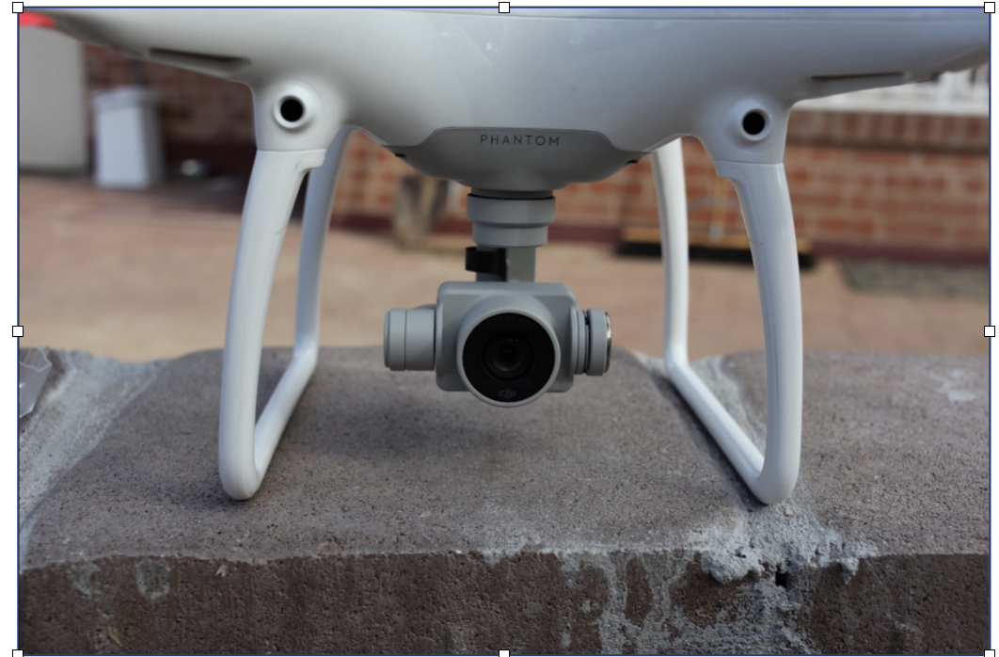
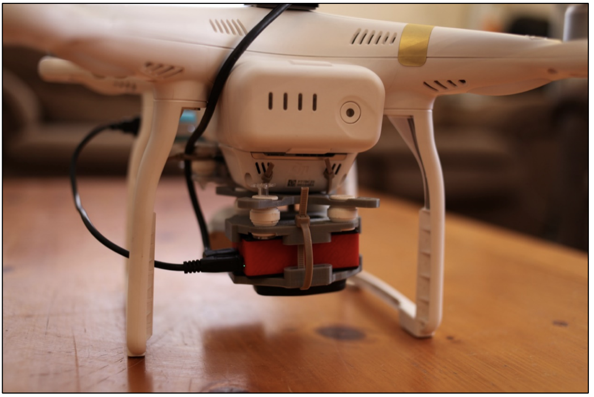

## Other Onboard Tech
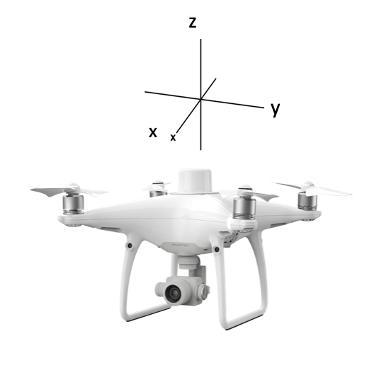
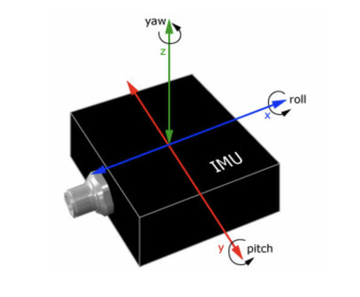

## Advantages of Drones

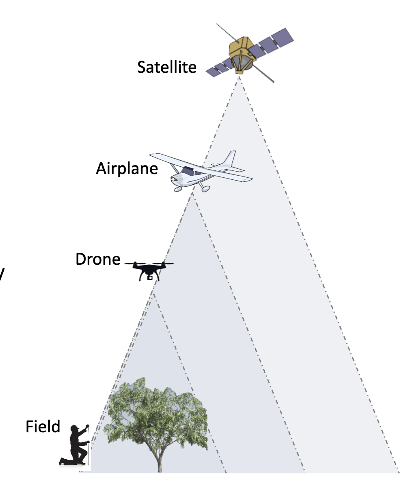

## Limitations of Drones
