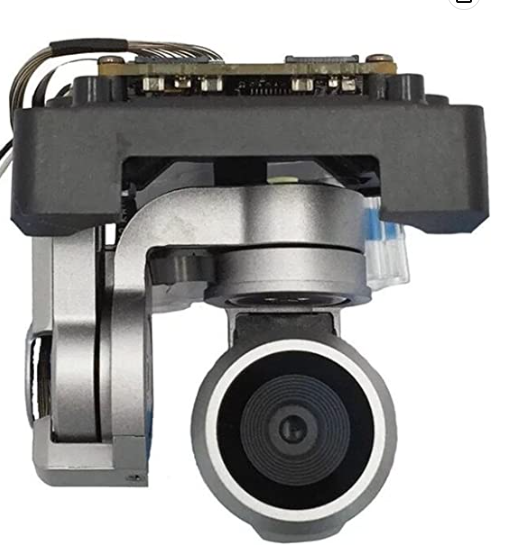
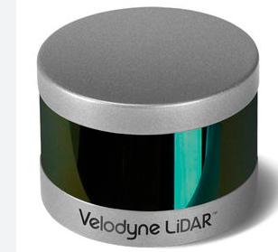

{target=_blank} 

# :material-cloud-braces: Resource Mapping with Drones

## About the Course
Welcome! This is an introductory course on how to use small camera drones for aerial mapping of land and resources.
 

* You will learn all the skills necessary to create precisely surveyed maps using photogrammetry methods. 

* We will cover all of the industries and applications where drone imagery maps are making big impacts on society. 

* Students will learn how to become licensed drones pilots with the Federal Aviation Administration (FAA). 
 
 

??? Tip "Instructor [Jeffrey Gillan, PhD](https://www.gillanscience.com){target=_blank}"

    I am a researcher at the University of Arizona and have been involved with aerial mapping and drones since 2011. Ever since, I have been using small drones to map and survey rangelands, forests, river corridors, wetlands, agriculture fields, and golf courses. I love helping others learn to use these powerful tools.
     
    {:height=190 width=190}

#### Instructor: 

 
 
 
 

Please watch this great short video on using drones to create 2D and 3D photographic maps. This is what you will learn to do in this class. 
<iframe width="560" height="315" src="https://www.youtube.com/embed/Blr3suSQt-Q" title="YouTube video player" frameborder="0" allow="accelerometer; autoplay; clipboard-write; encrypted-media; gyroscope; picture-in-picture; web-share" allowfullscreen></iframe>   

## Terminology
Let's get some terminology straight. There are a lot of different ways to refer to a remote control aircraft. I use the term **drone** most often because this has become the defacto term in society. Most people understand what you mean when you say **drone**. 
 

There are a number of different acronyms used to refer to drones. Some differ depending on the industry, application, or context. But for the most part, the following acronyms are generally interchangeable. 

**Unmmaned Aircraft (UA)**
 
This is an aircraft where the pilot is not onboard. It is piloted remotely, probably through radio signals. 
 
 
**Unmanned Aerial Vehicle (UAV)**
 
This is the same thing as a **UA**
 
 
**Unmanned Aerial System (UAS)**
 
This term refers to the entire flying system, not just the aircraft itself. Other components of the system include the remote control, the pilot, GPS, IMU, cameras, etc.
 
 
**Uncrewed Aerial System (UAS)**
 
This is the gender neutral term for **UAS** 
 
 
**Small Unmanned Aerial System (sUAS)**
 
This term refers to a specific weight class of UAV aircraft as designated by the FAA. To meet the definition of sUAS, aircraft need to weight less than 55 lbs on takeoff. 
 
 
**Remotely Piloted Aircraft (RPA)**
 
This is just another term for a drone that does not seem to get much use nowadays. 
 

## Camera Drone Models
There are many companies globally making many different drone models. There is an enormous range of capabilities and price points. The options can be overwhelming to people new to this topic. To simplify things, I will list here some of the most popular companies making and selling drones today. 
 
 
[DJI](https://www.dji.com/){target=_blank}
 
DJI, a China-based company, is the world leader in the production of consumer and professional drones for photographic mapping. They make the best equipment at the lowest prices. In 2013, DJI released the Phantom 1 multi-rotor drone which was one of the first consumer drones completely assembled and ready to fly. 
 
 
[Autel Robotics](https://www.autelrobotics.com/){target=_blank}
 
 
[Skydio](https://www.skydio.com/){target=_blank}
 
 
[Wingtra](https://wingtra.com/){target=_blank}
 
 
 
 

The following are some popular drone models worth checking out. The DJI Phantom 1 (circa 2013) was one of the first multi-rotor drones to be sold ready to fly out of the box. Users would mount a GoPro camera on it. This was followed up with the Phantom 2 Vision + (2014) which was one of the first drones to have an integrated camera. These early models kick-started the consumer drone industry. 

 

## Camera Drone Types
There are three basic drone types. Each has advantages and disadvantages that should be considered before buying or acquiring. The following section lists some of the characteristics of each type. 
 
 
{:height=200 width=300}
 

+ Usually Less Expensive to Buy

+ Vertical Launch and Landing

- Shorter Flight Endurance

- Able to Map Smaller Areas

* Very Precise Flying

* Precise Control of Gimbal Angle 
 
<iframe width="560" height="315" src="https://www.youtube.com/embed/4qCRVOGjFgI" title="YouTube video player" frameborder="0" allow="accelerometer; autoplay; clipboard-write; encrypted-media; gyroscope; picture-in-picture; web-share" allowfullscreen></iframe>

 
{:height=200 width=300}
 

* Relatively Expensive

* Throw Launch

* Belly Crash Landing

* Longer Flight Endurance

* Able to map very large areas

* Less Precise Flying

* Less Control of Camera Angle (via gimbal)
 
 
 

This video shows a Bat4 fixed-wing drone taking off from a runway in 2012. Thankfully, most fixed-wing drones are now smaller and can launched by a single person.

<iframe width="560" height="315" src="https://www.youtube.com/embed/82gn8EFOQd0" title="YouTube video player" frameborder="0" allow="accelerometer; autoplay; clipboard-write; encrypted-media; gyroscope; picture-in-picture; web-share" allowfullscreen></iframe>
 

<iframe width="560" height="315" src="https://www.youtube.com/embed/BlsHC1kSrE4" title="YouTube video player" frameborder="0" allow="accelerometer; autoplay; clipboard-write; encrypted-media; gyroscope; picture-in-picture; web-share" allowfullscreen></iframe>

 
{:height="200" width="300"}
 

* All the advantages of the fixed-wing with the ability of vertical take-off and landing. 

 
          

## Unmanned Aircraft System

 
The 'system' refers to the all of the additional components on and around the aircraft. There are a lot of interacting technologies that make drone mapping possible. 

* At the center of system is you the operator. 

* You will have a remote control and some kind of screen (e.g., Ipad) to communicate with the aircraft. 

* The aircraft will have a camara or sensor, an SD card to record the images, flight batteries, a global navigation satellite sensor (GNSS) and intertial measurement unit (IMU). 

* The GNSS is receiving signals from satellites orbiting the Earth to help the drone navigate autonomously.

* Additionally, the drone and the remote control may be connected (via radio) to a base station to improve the positioning of the aircraft.

* The remote control may also be connnected to cellular towers in order to get a basemap in your mapping application.  
 

This may seem a bit complex at first, but don't worry, we'll explain every component throughout this course. 

## Drone Sensors
The focus of this class is making photographic maps from drones, so the camera or sensor is at the center of everything we do. **Drones are flying cameras!** Many types of cameras are mountable on drones. We will cover the most common. 
 
 

### RGB
The most common is a red, green, blue (RGB) camera, which is the regular color camera that we all have used. Drones often come with an RGB camera integrated directly into the aircraft. That makes them very easy to use. Some more fancy drones allow you to swap out different camera types.
  
{:height=200 width=200}
{:height=300 width=300}

  
### Multi-Spectral
Multi-spectral cameras are very popular for drone mapping. Multi-spectral means that they collect specific wavelenghts of light including visible and near-infrared. One of the main applications for multi-spectral mapping is observing the health of vegetation in an agricultural or natural resource context. 
  
{:height=300 width=300}

Here are a few companies that make multi-spectral drone cameras
 
[AgEagle](https://ageagle.com/){target=_blank}
 
[Sentera](https://sentera.com/){target=_blank}

### Thermal
{:height=300 width=300}

### LiDAR (Light detection and ranging)
{:height=300 width=300}

 

### Hyperspectral 
Companies like [Headwall](https://www.headwallphotonics.com/products/hyperspectral-sensors){target=_blank} are manufacturing hyperspectral sensors that can be mounted on drones. 

{:height=350 width=350}

### Camera Mounting
Many integrated drone cameras will come mounted on a gimbal. A gimbal is a device used to stabilize and control the movement of a camera. It typically consists of motorized axes that work together to keep the camera level and steady. Most gimbals have a range of tilt that can be controlled from the remote control. 
 
 
{:height=300 width=300}
 
 

Shock mounting is mounting the camera in a way that reduces the impact of vibrations or movement on the camera. It is not motorized nor can the user change the camera angle remotely.  
{:height=500 width=500}

## Other Onboard Tech

{:height=300 width=300}

## Advantages of Drones
 

* Provides a crucial observational scale somewhere between field measurements and airplane imagery  

* Drone imagery is relatively easy and cheap to collect compared with airplane imagery

* Drone imagery can cover much larger areas compared with field measurements

* Drone imagery can observe and measure some vegetation and topographic characteristics better than field measurements. A great example is capturing the structure of a tree. This is very difficult to do with manual measurements. 

* Drones are highly portable and can be carried almost anywhere

* Drone imagery is on-demand. As long as the weather is good, I can go out and collect imagery. 

{:height=600 width=400}

## Limitations of Drones
 

* Limited Geographic coverage: A single small drone can cover hundreds and perhaps up to a few thousand acres. To cover larger areas, you need an airplane or a satellite. 

* Limited Flight Endurance (battery limitations). Most multi-rotor drones can stay aloft for only 25-30 minutes. 

* Legal limitations including flying height above the ground, line-of-sight requirements, no operations over people. 

* Requires expertise to plan, collect, process, and analyze drone imagery maps

* Cost: Drone equipment, processing software, and digital storage can all be expensive
