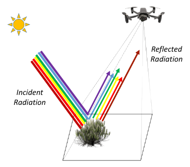

<figure markdown>
  { width="450" }
  <figcaption></figcaption>
</figure>

<figure markdown>
  { width="500" }
  <figcaption></figcaption>
</figure>

<figure markdown>
  { width="600" }
  <figcaption></figcaption>
</figure>

<figure markdown>
  { width="550" }
  <figcaption></figcaption>
</figure>

<figure markdown>
  { width="500" }
  <figcaption></figcaption>
</figure>

<figure markdown>
  { width="500" }
  <figcaption></figcaption>
</figure>

<iframe width="560" height="315" src="https://www.youtube.com/embed/4DdKGE0HIKc" title="YouTube video player" frameborder="0" allow="accelerometer; autoplay; clipboard-write; encrypted-media; gyroscope; picture-in-picture; web-share" allowfullscreen></iframe>
